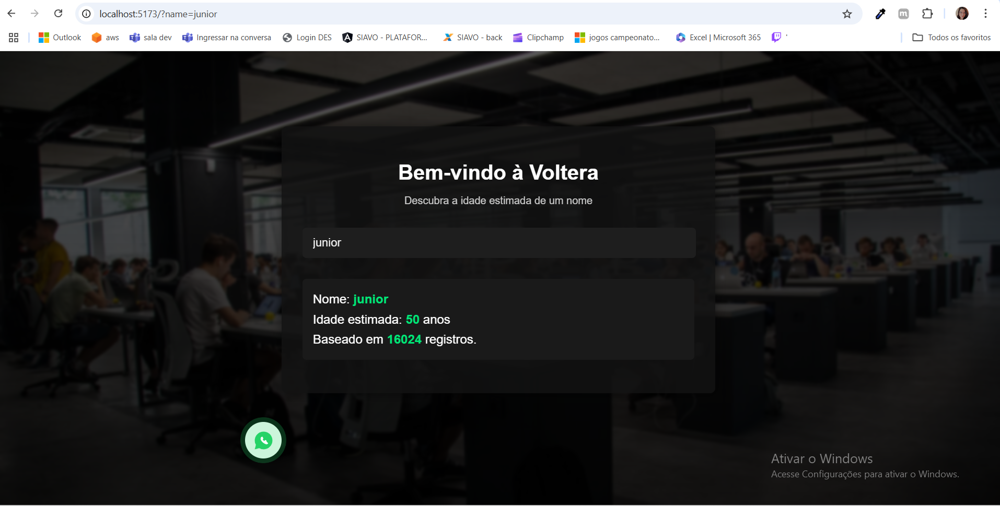

# Voltera – Estimador de Idade por Nome

Aplicação web feita com SvelteKit, que consulta uma API pública para estimar a idade média de pessoas com determinado nome.

## Objetivo

Este projeto foi criado com o propósito de demonstrar o uso de SvelteKit com componentes reutilizáveis, entrada de dados com validação, consumo de API externa e apresentação dinâmica de resultados com foco em simplicidade e responsividade.

## Tecnologias e padrões usados

- SvelteKit
- HTML + CSS puro
- Componentes reutilizáveis
- Organização sem dependências externas
- Separação entre lógica de apresentação e estado
- Preparação para testes unitários (comentados, para não interferir no build)

---

## Estrutura de Componentes

| Componente             | Descrição                                                                 |
|------------------------|--------------------------------------------------------------------------|
| `Box.svelte`           | Container genérico com espaçamento e bordas. Envolve seções internas.    |
| `PageHeader.svelte`    | Cabeçalho com título principal e subtítulo.                              |
| `NameInput.svelte`     | Formulário controlado para digitar o nome. Emite evento `submit`.        |
| `ApiResult.svelte`     | Exibe o resultado da API: idade estimada, total de registros ou erro.    |
| `WhatsappButton.svelte`| Botão fixo para contato via WhatsApp (acessível e responsivo).           |

Cada componente foi criado para:

- Ser 100% responsivo
- Ter interface clara via props
- Ser facilmente testável e reutilizável
- Ser leve e sem dependência de libs externas

## Testes unitários (comentados)

Todos os componentes possuem arquivos de teste em `src/lib/components/tests/`, escritos usando Vitest e Testing Library, porém **comentados** para evitar quebra do projeto ou necessidade de instalar novas libs.

### Exemplos:
- `Box.test.js`: verifica se o conteúdo do slot aparece corretamente
- `NameInput.test.js`: testa evento de `submit` com valor digitado
- `ApiResult.test.js`: cobre cenários de sucesso e erro

Se quiser ativá-los futuramente, basta descomentar os blocos de código, instalar as libs necessarias através do comando: 

 -- npm i -D vitest @testing-library/svelte @testing-library/jest-dom

Após instalação rodar os testes com o comando:

 -- npx vitest run              

## Estilo visual

baseado no site **https://voltera.com.br/**

- Fundo com imagem escura e pontos de luz para dar profundidade  
- Tipografia clean e contraste forte (branco no escuro)  
- Botões com cores personalizadas (padrão Voltera)  
- Adaptado para dispositivos móveis (testado em 320px até 1440px)

> O CSS usado está modularizado em arquivos como `background.css` para manter o layout central consistente.

---

## Organização de arquivos

src/
├── lib/
│ └── components/
│ ├── Box.svelte
│ ├── PageHeader.svelte
│ ├── NameInput.svelte
│ ├── ApiResult.svelte
│ └── WhatsappButton.svelte
│ └── tests/ ← testes comentados
├── routes/
│ └── +page.svelte ← onde tudo é renderizado
├── styles/
│ └── api-results.css
  └── background.css ← imagem e gradiente de fundo
  └── box.css
  └── name-input.css
  └── page-header.css
  └── whatsapp-button.css

##  Futuras melhorias (sugestões)

- ✅ Testes e2e
- ✅ Modo claro/escuro
- ✅ Deploy na Vercel ou GitHub Pages

## Print de exemplo

---

## Licença

MIT – Livre para uso, modificação e aprendizagem.  
© [Caroline Sarre](https://github.com/CarolineSarre)
